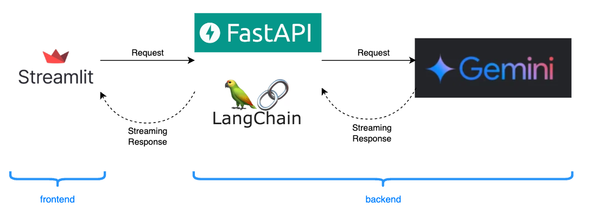
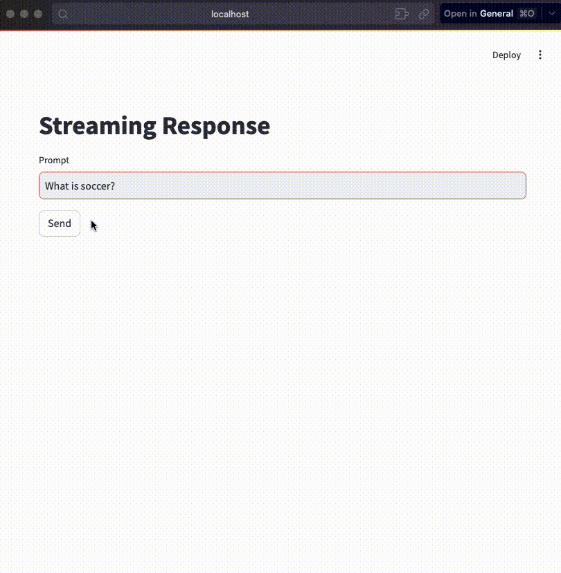

# Setup
```bash
poetry install
```

# To Run

```bash
poetry run streamlit run frontend/src/main.py
poetry run uvicorn backend.src.main:app --reload
```


# ストリーミングとは
そもそもストリーミングとは，サーバーがクライアントに対してデータを部分的に送信する方法です．一度にすべてを送信するのではなく，逐次データを送信するため，大きなデータセットや長時間かかる処理結果を送信する場合に役に立ちます．
このような動作をすることで，リアルタイム体験を提供できます．例えば，ストリーミング再生という言葉をよく耳にしますが，これは逐次インターネットからデータを送られて，ダウンロードすることなくそのコンテンツを楽しむことができます．チャットなどでも，回答がリアルタイムに確認できるため，待ち時間がないことや視覚的にみてもUXの向上が考えられます．


# お題
Pythonでよく使われるライブラリを使って，Geminiからの回答をストリーミングで取得できるようにしたいと思います．構成は以下のようにしました．コード全体は[こちら](https://github.com/rxmrsd/stream-response)に公開しており，以下では要点を記載します．





## Geminiの回答をストリーミングで取得
Langchainを経由して，Geminiの回答を取得します．要点としては，LangchainのChatVertexAIの`streaming=True`とすればOKです．ChatVertexAIに限らず，`ChatOpenAI`，`AzureChatOpenAI`でも同様の使い方で動作します．

```python:(抜粋)
from langchain_google_vertexai import ChatVertexAI

MODEL = "gemini-1.5-flash-preview-0514"

model = ChatVertexAI(model_name=MODEL, streaming=True)
message = "What is baseball?"

for chunk in model.stream(message):
    time.sleep(1)
    print(chunk.content)
    print("-----")
```

## フロントエンドにストリーミングで送信
FastAPIを使って，受け取ったリクエストに対して回答を送信します．手厚くメソッドが用意されており，`StreamingResponse`を使うことで，フロントエンドへ回答を逐次送ることができます．

```python:(抜粋)
from typing import Generator, Optional

from fastapi import FastAPI
from fastapi.responses import StreamingResponse
from langchain_google_vertexai import ChatVertexAI

DEFAULT_MESSAGE = "What is baseball?"
MODEL = "gemini-1.5-flash-preview-0514"

app = FastAPI()
model = ChatVertexAI(model_name=MODEL, streaming=True)


@app.post("/run_stream")
def stream_response(message: Optional[str] = None) -> StreamingResponse:
    if message is None:
        message = DEFAULT_MESSAGE
    gene = model.stream(message)
    chunk = text_response(gene)

    return StreamingResponse(
        chunk,
        status_code=200,
        headers=None,
        media_type=None,
        background=None,
    )


def text_response(gene: Generator):
    for chunk in gene:
        yield chunk.content
        yield "\n\n--------------------------\n\n"  # ストリーミングの区切りがわかるように
```

## Streamlitでストリーミング表示
Streamlitで，ChatGPTのように文字が表示されるには，`write_stream`を用います．まず，バックエンドから受け取るレスポンスを`stream=True`にし，それをシンプルに1文字ずつ表示しているのみです．

```python:(抜粋)
response = requests.post(
            url=URL,
            params=data,
            headers={'accept': 'application/json'},
            stream=True,
        )
st.write_stream(stream_data(response.text))

...

def stream_data(data: str) -> Generator[str, None, None]:
    for word in data:
        yield word
        time.sleep(0.02)
```

## 実際の出力
1文字ずつ出力されていますね．チャンクごとに区切り線を入れているため，それぞれをストリーミング形式で取得しているところも見て取れます．





# まとめ
Pythonでよく使われるライブラリを用いてストリーミングレスポンスを触ってみました．今回は，ストリーミングレスポンスをより視覚的にわかりやすくするため，非同期処理(`async def`)を利用しておりません．コードの改善点は諸々あると思いますが，ご容赦ください．


# 参考
- [総務省 情報通信白書 for Kids](https://www.soumu.go.jp/hakusho-kids/life/what/what_06.html)
- [Langchain Google Cloud Vertex AI](https://python.langchain.com/v0.1/docs/integrations/llms/google_vertex_ai_palm/)
- [FastAPI StreamingResponse](https://fastapi.tiangolo.com/advanced/custom-response/)
- [Streamlit write_stream](https://docs.streamlit.io/develop/api-reference/write-magic/st.write_stream)